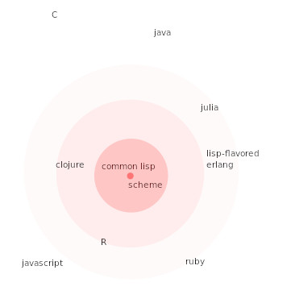

R: a lisp in C's clothing
========================================================
author: Tony Fischetti
date: 2020-02-10
autosize: true
css: style.css

instagram: @tony_fischetti_art

blog: onthelambda.com

book: data analysis with r

but first
========================================================
type: prompt

talk outline
========================================================
incremental: true

 

  - a brief history of R
  - a little bit o' R
  - case studies in R meta-programming
  - lisp and R homologues
  - is R a lisp?
  - german compound word time!

  - case study in probabilistic programming

a brief history of R
========================================================
type: prompt

a little bit o' R
========================================================
type: prompt

case studies in R meta-programming
========================================================
type: prompt

lisp and R homologues
========================================================
incremental: true

 
  - `on.exit` &nbsp;&nbsp;&nbsp;&nbsp; `unwind-protect`
  - `eval` &nbsp;&nbsp;&nbsp;&nbsp; `eval`
  - `do.call` &nbsp;&nbsp;&nbsp;&nbsp; `funcall` &nbsp;&nbsp;&nbsp;&nbsp; `apply`
  - `quote` &nbsp;&nbsp;&nbsp;&nbsp; `quote`
  - `bquote` &nbsp;&nbsp;&nbsp;&nbsp; `<backquote>`
  - `parse` &nbsp;&nbsp;&nbsp;&nbsp; `read`/`read-from-string`
  - `as.symbol` &nbsp;&nbsp;&nbsp;&nbsp; `intern`/`read-from-string`

  

What makes a lisp? (the naïve approach)
========================================================
incremental: true

 

  - dynamic typing and garbage collection
  - homoiconicity (lets you treat code as data)
  - lexical scoping?
  

What makes a lisp? (the naïve approach)
========================================================
transition-speed: fast

 

  - dynamic typing and garbage collection
  - homoiconicity (lets you treat code as data)
  - ~~lexical scoping~~
  
  
What makes a lisp? (the naïve approach)
========================================================
transition-speed: fast

 

  - dynamic typing and garbage collection
  - homoiconicity (lets you treat code as data)
  - ~~lexical scoping~~
  - s-expressions?

What makes a lisp? (the naïve approach)
========================================================
transition-speed: fast

 

  - dynamic typing and garbage collection
  - homoiconicity (lets you treat code as data)
  - ~~lexical scoping~~
  - ~~s-expressions~~
  
  
  
  
compound german word time!
========================================================
type: prompt
class: single-image

 
 
 
familienähnlichkeit

  
prototype concept theory
========================================================
class: single-image

